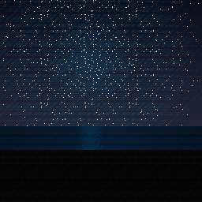
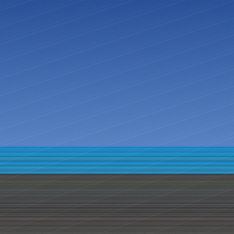

# Cryptseaside



Welcome to the Cryptseaside project.
Cryptseaside generates seaside images using Unix nanoseconds as the seed value.

## Usage

```shell
go install github.com/rhymof/cryptseaside/cmd/cryptseaside
```

### options

```
  -i    save as png. needs a directory named 'images' (default true)
  -s    stdout seed (default true)
  -u    stdout URI (default true)
  -v    stdout version (default true)
```

## Current version

Now, Cryptseaside version is alpha.
Destructive changes may occur.

## Probability of generation

|Type|Value|Probability|
|:--|:--|:--|
|Time|day|56/256|
|Time|evening|100/256|
|Time|night|100/256|

## Sample images




## Todo(alpha)

* [ ] a short range view objects(new package)
* [ ] Feature: plot object(internal)
* [ ] clouds
* [ ] Special mode(new package)
* [ ] Make sunset more beautiful